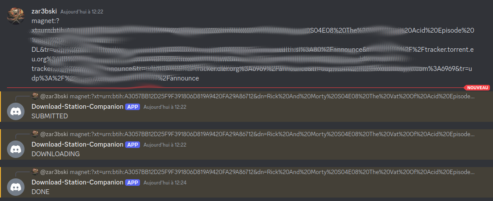

# download-station-companion
Handle your synology downloads from a discord channel 

## Features
Download-station-companion (**ds-companion**) is the dumbest handler covering 90% of my needs

### Covered needs

* launch a download by posting a magnet link on a discord channel
* follow it progression with the answers to this very post

## Usage

**DS-companion** is designed to be executed as a **cronjob**

> currently, the default interval is every two minutes (`*/2 * * * *`). The rest of the documentation will follow this assumption

### Set up a discord application/bot to provide an API access 

The bot: 
* does not need to be public
* needs the following permissions:
  * `View Channels`
  * `Send Messages`
  * `Read Message History`
  * `Add Reactions`

### Install 

TODO

|        arg        |  type  |       env var       | description                                                            |
| :---------------: | :----: | :-----------------: | :--------------------------------------------------------------------- |
|   discord_token   | String |   `DISCORD_TOKEN`   | bot's permanent token                                                  |
|  discord_channel  | String |  `DISCORD_CHANNEL`  | ID of the discord channel to be used                                   |
|   minutes_delta   | usize  |   `MINUTES_DELTA`   | How ofter should the channel be checked(default 2)                     |
| synology_root_api | String | `SYNOLOGY_ROOT_API` | Root API of your local Synology server (e.g. http://192.168.1.45:5000) |
|   synology_user   | String |   `SYNOLOGY_USER`   | synology user with rights on the Download Station app and it API       |
| synology_password | String | `SYNOLOGY_PASSWORD` | password of this very user                                             |

