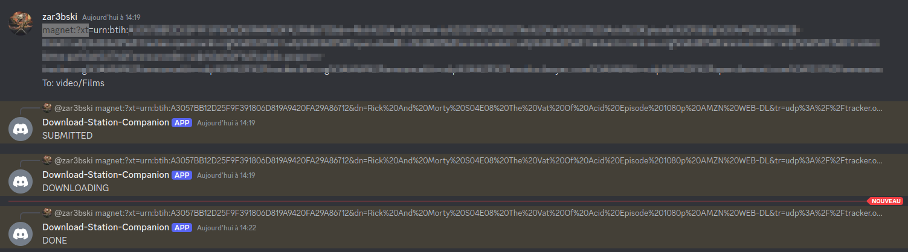

[](/LICENSE)


# download-station-companion
Handle your synology downloads from a discord channel 

## Features
Download-station-companion (**ds-companion**) is the dumbest handler covering 90% of my needs



### Covered needs

* launch a download by posting a magnet link on a discord channel
* follow it progression with the answers to this very post
* set destination folder

## Usage

**DS-companion** is designed to be executed as a **cronjob**

> currently, the default interval is every two minutes (`*/2 * * * *`). The rest of the documentation will follow this assumption

### Set up a discord application/bot to provide an API access 

The bot: 
* does not need to be public
* needs the following permissions:
  * `View Channels`
  * `Send Messages`
  * `Read Message History`
  * `Add Reactions`


### Install 

as **root**

```shell
# depending on your architecture, choose
wget https://github.com/zar3bski/ds-companion/releases/latest/download/ds-companion-<aarch64 | x86_64 > -O /usr/local/bin/ds-companion
chmod +x /usr/local/bin/ds-companion

touch /etc/cron.d/ds-companion
chmod 600 /etc/cron.d/ds-companion

cat <<EOT >> /etc/cron.d/ds-companion
# ds-companion checks every two minutes for new download tasks
*/2 * * * * root /usr/local/bin/ds-companion --discord-token <DISCORD_TOKEN> --discord-channel <DISCORD_CHANNEL> --synology-root-api <SYNOLOGY_ROOT_API> --synology-user <SYNOLOGY_USER> --synology-password <SYNOLOGY_PASSWORD>
EOT
```

|        arg        |  type  |       env var       | description                                                            |
| :---------------: | :----: | :-----------------: | :--------------------------------------------------------------------- |
|   discord_token   | String |   `DISCORD_TOKEN`   | bot's permanent token                                                  |
|  discord_channel  | String |  `DISCORD_CHANNEL`  | ID of the discord channel to be used                                   |
|   minutes_delta   | usize  |   `MINUTES_DELTA`   | How ofter should the channel be checked(default 2)                     |
| synology_root_api | String | `SYNOLOGY_ROOT_API` | Root API of your local Synology server (e.g. http://192.168.1.45:5000) |
|   synology_user   | String |   `SYNOLOGY_USER`   | synology user with rights on the Download Station app and it API       |
| synology_password | String | `SYNOLOGY_PASSWORD` | password of this very user                                             |

### Launch tasks by sending messages

```
magnet:?xt<YOUR MAGNET LINK>
To: <DESTINATION FOLDER> (optionnal)
```

